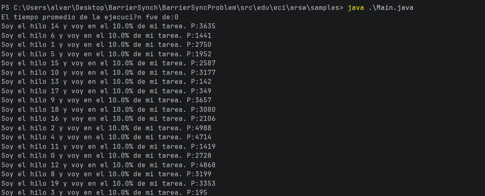
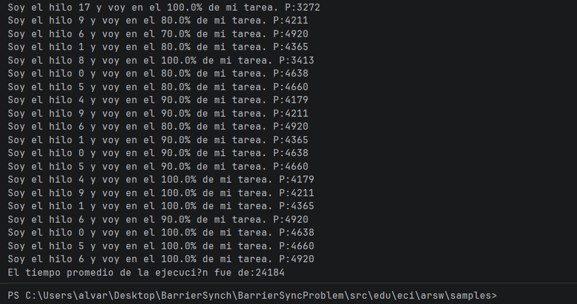

# Synchronization Workshop — Barrier Pattern

**Course:** ARSW  
**Student:** Brayan Loaiza  

---

## Description

This lab implements the barrier synchronization pattern in Java.
The program runs N threads that perform the same task at different speeds.
The goal is to calculate the average execution time **only after the last thread has finished**.

---

## Part 2 — Execution without synchronization

### What does the original program do?

The main thread starts all 20 threads and immediately tries to read their results
without waiting for them to finish. Since the threads have just started, `resultado` is `0` in all of them.

### Evidence



### Result obtained

```
El tiempo promedio de la ejecución fue de: 0
```

### Why is it incorrect?

The main thread does not wait for the worker threads to finish. When it calls
`getResultado()`, the threads are still running and their `resultado` field has not been
assigned yet, so it returns `0`. The average of twenty zeros is zero.

---

## Part 3 — Solution: barrier synchronization with `join()`

A second loop was added between the `start()` call and the result collection.
Each call to `hilos[i].join()` causes the main thread to pause until that thread
finishes. The main thread only moves forward when **all** threads have completed.

```java
for (int i = 0; i < numHilos; i++) {
    hilos[i].start();
}

// Barrier: wait for all threads to finish
for (int i = 0; i < numHilos; i++) {
    try {
        hilos[i].join();
    } catch (InterruptedException e) {
        e.printStackTrace();
    }
}

for (int i = 0; i < numHilos; i++) {
    tiempoPromedio += hilos[i].getResultado();
}
```

---

## Part 4 — Verification with synchronization

### Evidence



### Result obtained

```
El tiempo promedio de la ejecución fue de: 24184
```

### Why is it correct now?

The main thread blocks at the `join()` loop until the last thread finishes.
Only then does it read the `resultado` values, which have been correctly assigned
by each thread at the end of its execution.

---

## Conclusion

The barrier pattern ensures that a synchronization point is reached by all
participants before continuing. In Java, `Thread.join()` is the most direct
implementation of this pattern for a fixed set of threads.
